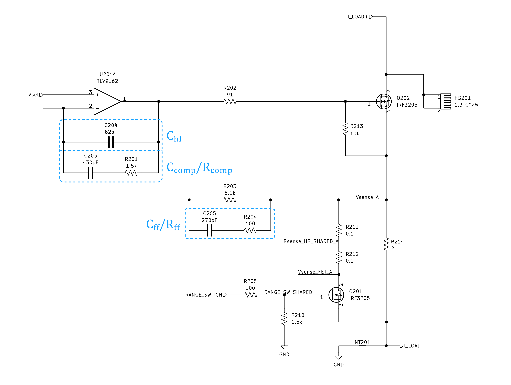
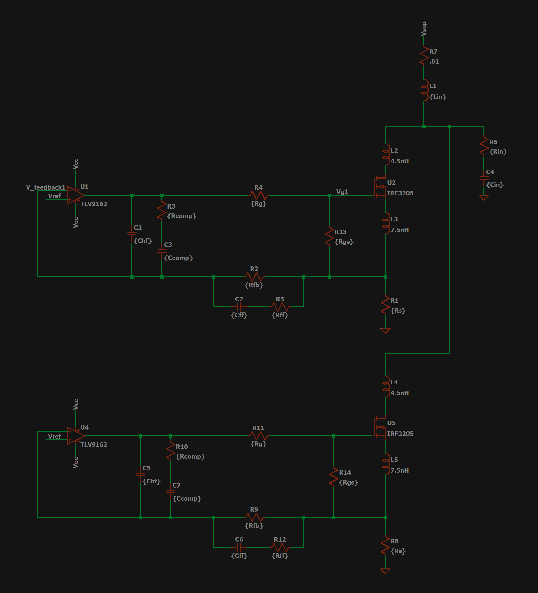
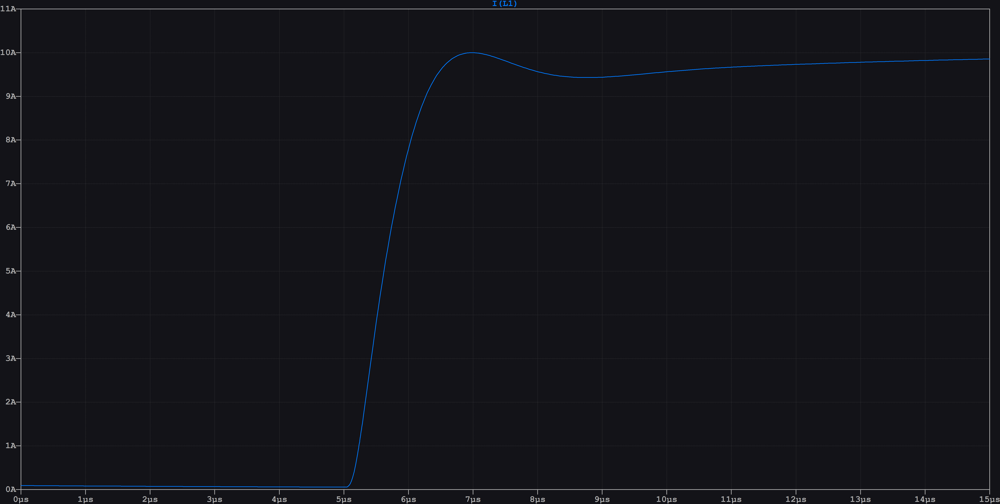
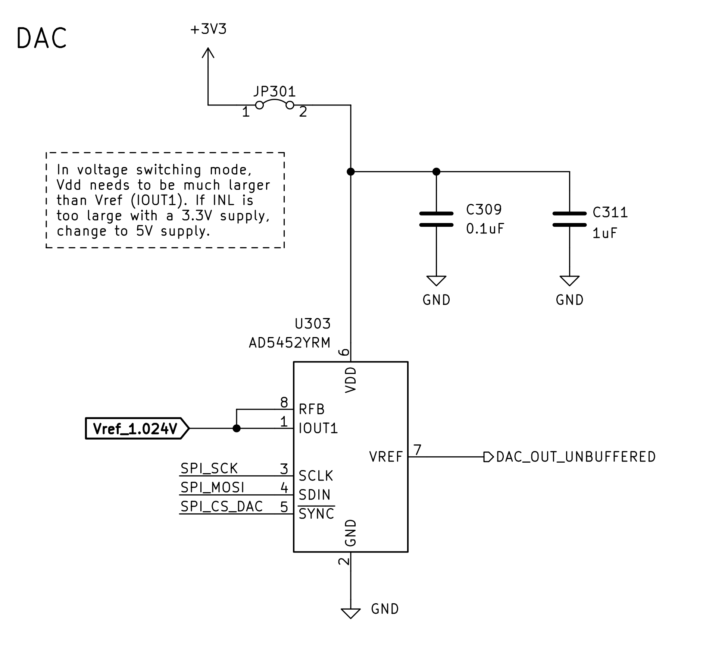
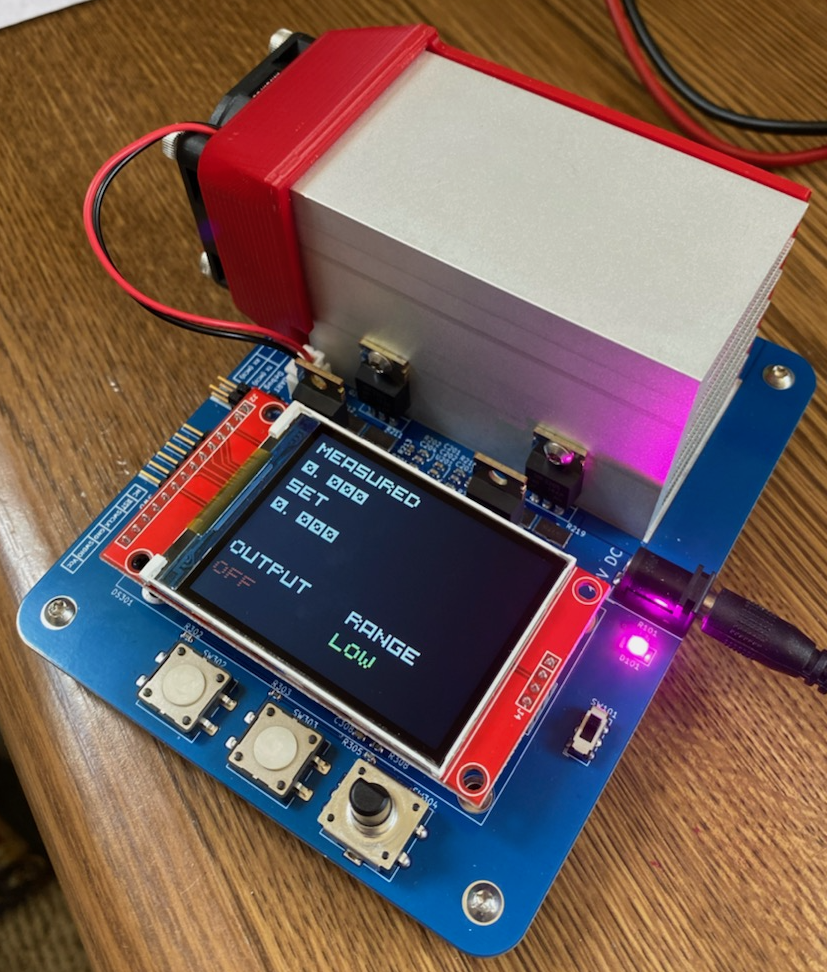
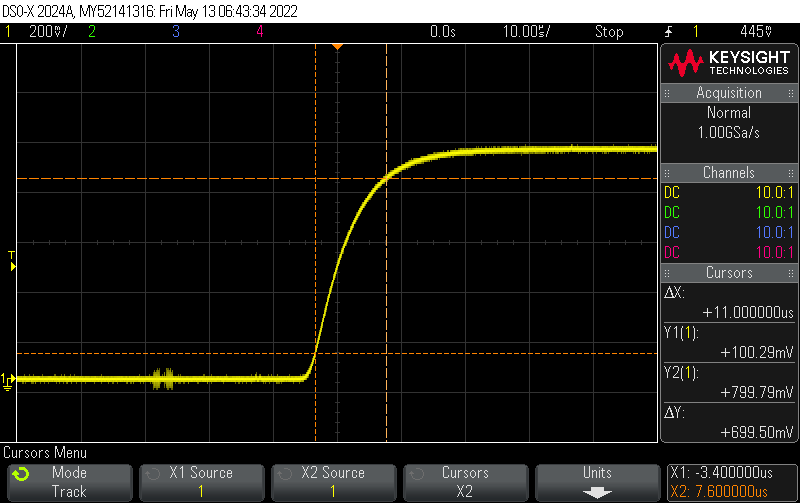

# Overview
This project is a 50 W electronic load. The table below outlines the basic specs for the load.

| Description                                 | Spec               |
|---------------------------------------------|--------------------|
| Supply Voltage                              | 12 V               |
| Slew Rate                                   | 10 A/µs        |
| Maximum Current                             | 10 A               |
| Maximum Power Dissipation                   | 50 W               |
| Program Resolution (low range / high range) | 1 mA / 10 mA       |
| Program Accuracy                            | 0.2% $\pm$ 0.2% FS |
| Maximum Overshoot                           | 1%                 |
| Measurement Readout Accuracy                | 0.2% $\pm$ 0.2% FS |

The primary challenge with designing an electronic load is to making it stable over a wide range of load currents and input conditions. This challenges becomes worse when the design demands a fast rise time. The target slew rate for this load is 10 A/µs, which is quite fast. In comparison, the [Keysight EL34243A](https://www.keysight.com/zz/en/assets/3120-1430/data-sheets/EL30000-Series.pdf) has a slew rate of about 5 A/µs. 

This challenge is two-fold. The initial and obvious challenge is the control loop, which is discussed in detail in the [Theory Of Operation](#theory-of-operation) section. Simply, this requires proper compensation to maintain stability and rise time. The more nefarious issue is the issue of input impedance, largely due to the inductance of the wires connecting the load to the source being tested. This inductance is, in general, not known and can vary widely, in the range of 50 nH to 2 uH between short, heavy gauge wire and garden-variety banana cables. This inductance has a large affect on the control loop and can significantly change the rise time and stability of the load. 

Because the current level and slew rate are so large, the slew rate and overshoot specs are defined to be valid for input inductances in the range of 100 nH–roughly 10 cm of 12 AWG wire. This was the assumed input inductance during the design stage. 

# Design and Simulation
## The Control Loop
Figure 1 shows the main control circuit. The main compensation components have been highlighted. Q201 and gate resistors are used to switch the current range between 1 A and 10 A. For this analysis, assume either R211+R212 OR R214 is connected. R202 isolates the output of the opamp from the gate capacitance, which is required for stability. This compensator is known as a [*Type III compensator*](https://www.ti.com/seclit/ml/slup340/slup340.pdf). There are two compensators, each designed to sink up to 0.5/5.0 A. This is done to reduce power dissipation in each transistor.

 
<figcaption align = "center"><b>Figure 1: Control Loop Circuit</b></figcaption>

The poles and zeros of the compensator can be set by the compensation components outlined in Figure 1, with equations given in [Switch-mode power converter compensation made easy](https://www.ti.com/seclit/ml/slup340/slup340.pdf).

Figure 2 shows the SPICE simulation setup for the control loop, where the spice models for the TLV9162 were provided by TI and the spice models for the IRF3205 were provided by Infineon. R6 and C4 are used to compensate for the inductance L1. 

 
<figcaption align = "center"><b>Figure 2: Simulation Schematic</b></figcaption>

The values for the compensation components were tuned until the desired step response was obtained. Figure 3 below shows the simulated step response to 10 A for RS = 0.2, L1 = 100 nH. The compensation values are given in Figure 1. The overshoot spec is met and the 10% to 90% rise time was measured to be 1.03µs. 

 
<figcaption align = "center"><b>Figure 3: Simulated Step Response</b></figcaption>

## Controlling The Control Loop
An STM32L041 was used as the microcontroller for this board. It was chosen for its availability at the time of design (which was during the 2022 parts shortage). It features an on-board 12-bit ADC, which has enough resolution to meet the measurement specs, but the resolution can be further improved using hardware oversampling. 

A DAC is used to set the control voltage for the control loop. The chosen DAC is the ADI AD5452YRM, a fast settling time R2-R DAC. This DAC was chosen as the step response of the DAC needed to be at least as fast as the response of the overall control circuit. The chosen DAC should be more than sufficent for the task. 

Figure 4 shows the DAC arrangement. As noted in the image, the reference voltage is being fed into the current output pin of the DAC and the output voltage is being taken from the Vref pin. R2-R DACs generally allow this arrangement (unless the output is internally buffered), but typically require the reference voltage to be much less than than the supply voltage to overcome the required Vgs of the internal FETs. The ADI datasheet is not clear on how much larger Vcc should be, so the first attempt simply used a 3.3V supply. 

The output impedance of an R2-R DAC in this reverse arrangement is equal to the R value, which is 10k for the AD5452YRM. It is possible that the RC time constant could slow down the output transition, so the traces connecting the DAC to the opamp input should be kept short.

 
<figcaption align = "center"><b>Figure 4: DAC Schematic Block</b></figcaption>

## Heatsinking
A large heatsink was chosen to be capable of dissipating at least 50 W with forced air cooling. The thermal calculations were done assuming smooth fin design, however, the chosen heatsink has serrated fins which should significantly improve the heatsinking ability. 

## Human Interfacing
A colored LCD, two pushbuttons, and a rotary encoder with a built-in push button is used to interface with the electronic load. The primary function of the buttons are:
- Output On/Off
- Slew Rate Setting
- Range Selection

The rotary encoder is used to set the load current.

# Results
The final board is shown in Figure 5. All basic DC functions worked including range switching, current measurement, and current sinking up to 10 A. It was found to be stable over the entire range of set current, with some small amount of ringing on the 10 A setting with 2X3ft (6ft ~ 2nH input inductance). 

 
<figcaption align = "center"><b>Figure 5: Assembled Ampeater</b></figcaption>

The output was found to be overdamped when two 8 cm lengths of 12 AWG wire were used to connect to the load. The scope capture is shown in Figure 6. The capture is measured across Rsense of one of the control loops with a resistance of ~0.2 Ohms, so 1 V equals 10 A of load current. The capture shows a clearly overdamped response, which makes the load very stable but much slower than desired with a rise time of ~11 µs. To adjust this, the compensation components must be tuned and the measurement performed until the results are acceptable. This is still a TODO item. 

 
<figcaption align = "center"><b>Figure 6: Scope capture measured across one controller's Rsense</b></figcaption>

Both the hardware and software are currently in prototype phase and much remains to be done, especially on the software side. However, early results are quite good and all specs appear to be met except the rise time. Tuning of component values will need to be done to ensure this spec is met.

# TODO
- ## Hardware
  - Add output buffer to range select switch
  - Increase reference voltage
  - (Probably) decrease low range current sense resistor
  - Make slightly longer for connectors
  - Add power switch labels
  - Add spots for R6 and C4 (simulation reference designators) compensation resistor/cap
  - Tune compensation values on prototype board to increase rise time. 
- ## Software
  - Investigate a continuos mode ADC sampling that doesn't require polling of every channel for a single channel read
  - Use a faster LCD Library utilizing DMA
  - Add proper return type and error throwing for completion 
  - Use the Vrefint to measure external VDDA for more accurate readings
  - Implement encoder velocity 
  - Implement slew rate limiting
  - Implement a calibration routine to calibrate to resistors 
- ## Documentation
  - Add more discussion on compensator in Theory Of Operation (not currently done do to the absurdity of trying to add equations to GitHub's Markdown)
  - Update images of board